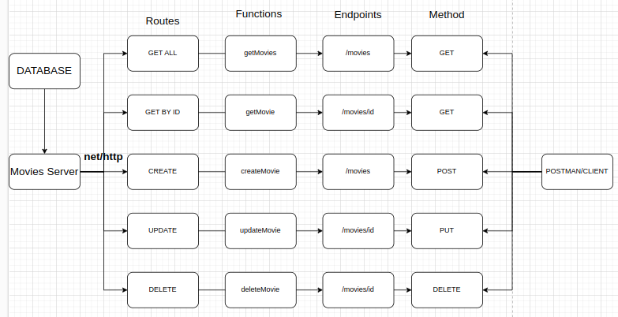

# Go Basic CRUD REST API

## Endpoints

### 1. `/movies`

-   Method: GET
-   Description: Displays all movies Map.

### 2. `/movies`

-   Method: POST
-   Description: Add new Movie to the map, and then return the new list of the movies.

### 3. `/movies/${id}`

-   Method: GET
-   Description: Get the specific movie by ID, returned as a JSON.

### 4. `/movies/${id}`

-   Method: DELETE
-   Description: Delete the movie specific by the ID, and returned the remaining data (as a JSON).

### 5. `/movies/${id}`

-   Method: PUT
-   Description: Update/edit specific movie by ID, and then returned all Movies (as a JSON).

## System Design

